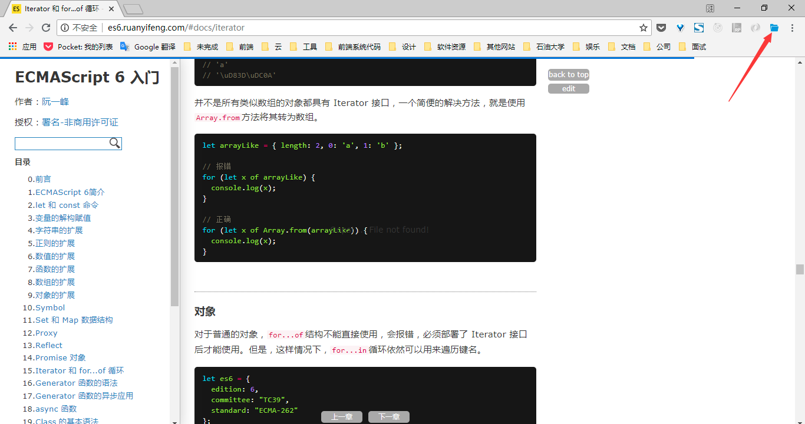

# open-last
Chrome插件，可以打开网页上一次浏览的位置。

### 使用步骤  
<!-- 1. 到[release](https://github.com/yidreamc/open-last/releases)中下载最新版，然后打开安装   -->
1. 克隆`master`分支上的代码，浏览器打开开发者模式直接安装即可。
2. 当浏览到一个比较长的网页，想要保存进度时，点击插件图标即可保存位置。

  

3. 下次在打开改网页时，就会自动跳转到上次阅读的位置。

### 项目说明
- `master`分支为线上分支，功能可能不是最新的，但是是最稳定的
- `dev`分支或其他功能分支为开发分支，上面有最新的代码

### 可能的一些问题解释
- 因为谷歌浏览器的刷新行为时保存上次阅读位置的，因此我在该插件中没有处理刷新行为
- 在下个大版本中会提供删除保存站点的功能，但暂时不打算开发

### 待解决的事项
- 优化插件在单页应用中的行为，使其能够记住单页应用的站点而不是单页应用的一个hash路由
- 更改一下图标的显示，使其能够在未保存站点时显示灰色，保存之后显示正常颜色
- Chrome应用商店发布
- 优化代码结构
- 优化显示界面
- 增加跨平台特性，提供后端支持
